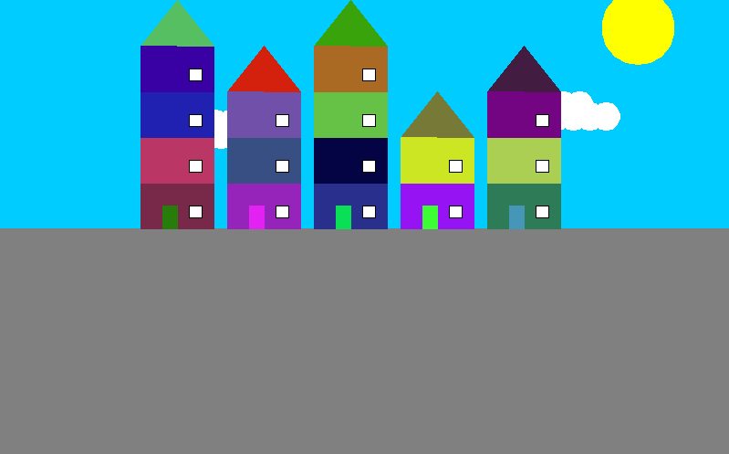

# Projet Architecture urbaine sur turtle

Ce projet utilise le module Turtle de Python pour créer un dessin représentant une ville. Le code génère un ciel, des nuages, un soleil, et une rue composée d’immeubles. Chaque immeuble a des murs colorés, un nombre d’étages aléatoire, ainsi que des fenêtres et un toit.

## Sommaire
- [Aperçu](#aperçu)
- [Fonctionnalités](#fonctionnalités)
- [Utilisation](#utilisation)
- [Technologies Utilisées](#technologies-utilisées)
- [Licence](#licence)

## Aperçu

## Fonctionnalités

- **Génération de bâtiments aléatoires** : Chaque immeuble est créé avec un nombre d’étages aléatoire et une couleur différente pour les murs, donnant une apparence unique à chaque bâtiment.
- **Création de détails** : Le ciel, le soleil et les nuages sont également générés pour donner du réalisme.
- **Rendu d'une rue complète** : Avec plusieurs immeubles, le code génère une rue entière, simulant une  ville.

## Utilisation

Pour exécuter le projet, lancez le fichier `Architecture_urbaine_turtle.py` dans un environnement Python compatible avec Turtle.

## Technologies Utilisées

- **Python** : pour la logique du programme.
- **Module Turtle** : pour le rendu graphique de la ville.

## Licence

Réalisé dans le cadre d'un projet scolaire en mars 2023.
